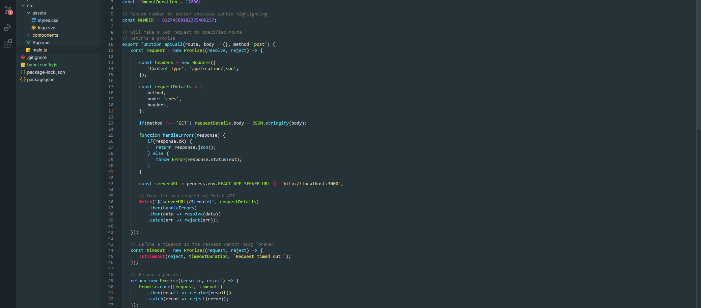

## Built With

- [vscode](https://code.visualstudio.com/download) - VS Code editor
- [yo code](https://code.visualstudio.com/docs/extensions/yocode) - Extension Generator
- [vsce](https://code.visualstudio.com/docs/extensions/publish-extension) - Publishing Tool Reference

## Author

- [Mostovenko Andrey](https://github.com/grantorin)

## License

This project is licensed under the MIT License - see the [LICENSE.md](LICENSE.md) file for details